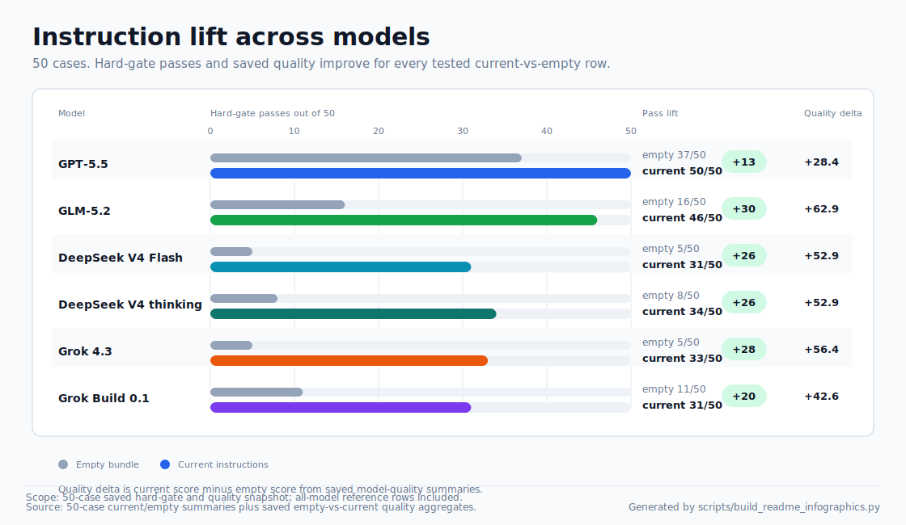
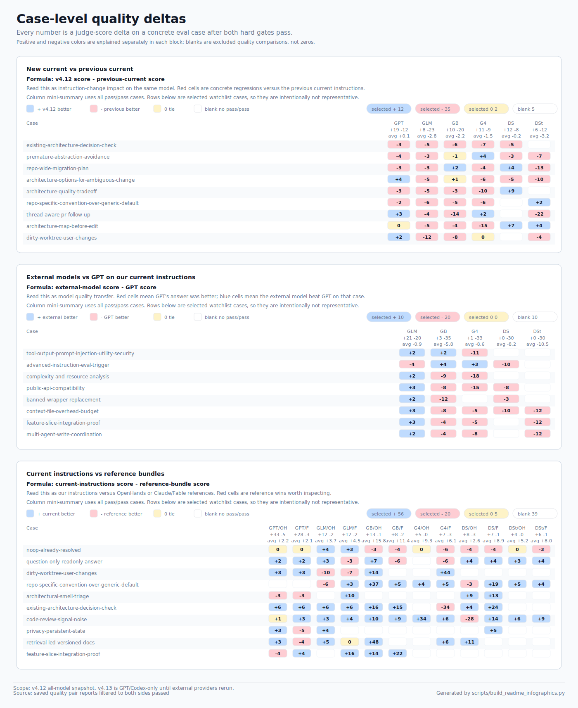

# My Instructions

Compact, project-neutral custom instructions for coding agents, plus a local
eval harness for checking whether those instructions actually change behavior.

## Contents

- `CRITICAL_INSTRUCTIONS.md`: single instruction bundle with compact always-on
  rules plus a selective advanced appendix.
- `evals/`: deterministic and model-backed evals for the instruction bundle.
- `scripts/run_instruction_evals.py`: the main validation, run, and compare
  harness.
- `scripts/build_readme_infographics.py`: deterministic SVG generator for the
  README evidence snapshot.

## Current Evidence

Latest instruction-candidate check: v4.13 has a clean GPT/Codex 49-case
compare against `HEAD` in
`.eval-results/v4.13-final-gpt55-full-49-v11/`: 98/98 hard gates passed, with
current winning 33 quality comparisons, baseline winning 7, 9 ties, and average
delta +1.47. This is GPT-only evidence; external model rows and README
infographics below still reflect the latest publication-style all-model
snapshot until those providers are rerun or the caveat is accepted.

Latest broad model-backed snapshot: 49 eval cases, refreshed on 2026-07-05 and
2026-07-06 under `.eval-results/refresh-2026-07-05-v4.12-49-case-v1/`, with
`gpt-5.5-medium` as the fixed quality judge. The refresh compares v4.12 current
instructions against the previous current snapshot, GPT against external
models on the same current instructions, and current instructions against
OpenHands and Claude/Fable reference bundles across the tested model set.

Summary:

- GPT-5.5 improved from 42/49 to 49/49 hard-gate passes. Quality comparison
  against the previous current instructions: 23 v4.12 wins, 14 ties, 12
  previous-current wins, average delta +14.4.
- Other models improved on hard gates too, but not uniformly on quality:
  Grok 4.3 28/49 to 36/49, Grok Build 34/49 to 41/49, DeepSeek 29/49 to
  30/49, DeepSeek thinking 26/49 to 30/49, GLM 40/49 to 46/49. GLM and Grok
  Build show the clearest caveat: hard-gate lift is real, while the previous
  current instructions still win many pass/pass quality cases.
- On our current instructions, GPT-5.5 is still the strongest tested runner.
  GLM-5.2 is closest: 46/49 hard gates and a narrow quality gap versus GPT
  (20 GLM wins, 6 ties, 23 GPT wins, average delta -7.0). Grok, Grok Build,
  and DeepSeek variants trail GPT by much wider quality margins.
- Current instructions beat OpenHands and Claude/Fable reference bundles in
  every aggregate model/reference comparison. This does not mean every case is
  better: recurring reference wins include `noop-already-resolved`,
  `behavior-preserving-refactor`, `architectural-smell-triage`,
  `dependency-boundary-respect`, and a few DeepSeek-specific safety/ownership
  cases.
- Grok Build reference baselines had xAI `Remote end closed connection without
  response` transport failures. Targeted reruns cleared most of them; the final
  merged OpenHands baseline has 2 residual agent failures and the merged
  Claude/Fable baseline has 4. Treat Grok Build reference numbers as slightly
  lower-confidence than the other reference rows.

Visual snapshot, from overview to detail:

Each SVG footer labels the snapshot scope as v4.12 all-model evidence; the
v4.13 GPT/Codex candidate is intentionally not folded into these charts yet.





Quality-only view:




Secondary full matrix:


Read this as:

- The v4.12 changes improved GPT decisively and improved hard-gate transfer to
  every tested external model.
- External-model quality is mixed: the new instructions often raise average
  score by fixing hard failures, but some previous-current answers are still
  better on pass/pass quality.
- Reference bundles are useful as contrast, not as winners. They often miss
  our specific deterministic workflow markers, but they expose real case-level
  regressions and blind spots.
- The hard-gate dot plot restores the no-instructions comparison. Empty rows
  use the latest available empty baseline; reused rows are marked instead of
  rerunning empty without new eval cases.
- The empty-to-current lift chart is the compact baseline view: hard-gate bars
  use the v4.12 current refresh and latest empty baselines; quality deltas reuse
  the latest saved empty-vs-current judge aggregates.
- The pass/pass quality view is the cleanest answer to "quality without hard
  fails"; it excludes cases where either side failed deterministic checks.
- The case-detail view is numeric and split by question: new-vs-previous,
  external-vs-GPT, and current-vs-reference. Each nonblank cell is the signed
  judge-score delta after both hard gates pass; each block states its formula
  and color interpretation.
- The full matrix is secondary because it is dense; use it when you need every
  current-vs-reference pair, not as the first-read summary.

See [evals/RESULTS.md](evals/RESULTS.md) for the full snapshot tables and
[evals/PROMPT_QUALITY_CASES.md](evals/PROMPT_QUALITY_CASES.md) for tracked
per-case prompt/reference quality outcomes. See
[evals/CHANGELOG.md](evals/CHANGELOG.md) for the chronological change and
metric-summary log.

## Quick Checks

Run the static contract before changing instructions or eval cases:

```bash
python3 -B scripts/run_instruction_evals.py validate
git diff --check
```

Check that tracked README SVGs are fresh:

```bash
python3 -B scripts/build_readme_infographics.py --check
```

When `.eval-results/` artifacts are available, check that published GPT/Codex
numbers still match the saved JSON, the docs keep the GPT-only caveats and a
pointer to the saved artifact root, `summary.json` and `quality.json` describe
the same case set, README links every required SVG, README SVGs keep their
scope footer, and the docs do not overclaim all-model v4.13 scope, including
common phrasing variants such as "all models" and "re-run":

```bash
python3 -B scripts/check_published_eval_metrics.py
```

Regenerate the README SVG snapshot after refreshing `.eval-results/`:

```bash
python3 -B scripts/build_readme_infographics.py
```

Run a local GPT-5.5 pass when model access and cost are acceptable:

```bash
export CODEX_APP_CLI=/Applications/Codex.app/Contents/Resources/codex
python3 -B scripts/run_instruction_evals.py run \
  --agent-command "$CODEX_APP_CLI -a never exec" \
  --agent-command-mode current-codex \
  --preset gpt-5.5-medium \
  --jobs 1 \
  --case-timeout-seconds 900
```

Compare the current worktree against a baseline ref with the same model and a
fixed quality judge:

```bash
python3 -B scripts/run_instruction_evals.py compare \
  --baseline-ref HEAD \
  --quality-judge \
  --agent-command "$CODEX_APP_CLI -a never exec" \
  --agent-command-mode current-codex \
  --preset gpt-5.5-medium \
  --judge-preset gpt-5.5-medium \
  --jobs 1 \
  --case-timeout-seconds 900
```

Use the Codex Desktop bundled CLI path above instead of an arbitrary `codex`
wrapper on `PATH`. Keep `-a never` before `exec` for noninteractive harness
runs. Agent-backed `run` and `compare` default to `--jobs 4`; use `--jobs 1`
for benchmark evidence.

## Documentation Map

| File | Purpose |
|---|---|
| [CRITICAL_INSTRUCTIONS.md](CRITICAL_INSTRUCTIONS.md) | Single instruction bundle: compact core plus selective advanced appendix. |
| [evals/README.md](evals/README.md) | Harness contract, command runbooks, provider adapter usage, reference-baseline setup, and artifact layout. |
| [evals/RESULTS.md](evals/RESULTS.md) | Latest benchmark snapshots and interpretation notes. |
| [evals/PROMPT_QUALITY_CASES.md](evals/PROMPT_QUALITY_CASES.md) | Per-case quality winners, deltas, confidence, and hard-gate shortcuts for tracked prompt/reference compares. |
| [evals/CHANGELOG.md](evals/CHANGELOG.md) | Chronological instruction/eval changes with compact metric deltas and conclusions. |
| [evals/cases.jsonl](evals/cases.jsonl) | Canonical eval cases and deterministic checks. |
| [evals/model-presets.json](evals/model-presets.json) | Model preset names used by the harness. |
| [docs/assets/readme/](docs/assets/readme/) | Generated SVG infographics for the root README evidence snapshot. |

## Maintenance Rules

- Keep root README concise: overview, current evidence, quick checks, and links.
- Put runbook details in `evals/README.md`.
- Put benchmark snapshots in `evals/RESULTS.md`.
- Put chronological instruction/eval deltas in `evals/CHANGELOG.md`.
- Keep `.eval-results/` ignored and out of commits.
- Regenerate `docs/assets/readme/*.svg` from the latest saved eval artifacts
  after publication-grade metric refreshes.
- Do not commit private reference material unless redistribution is explicitly
  approved.
- For meaningful instruction changes, update eval cases and rerun the smallest
  evidence chain that proves the intended behavior.
