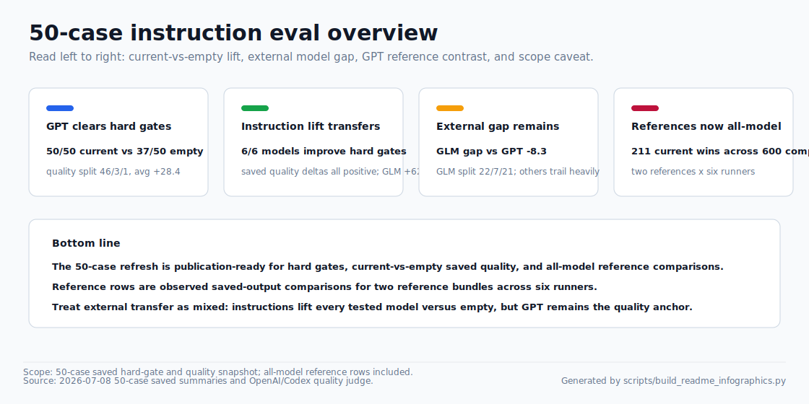
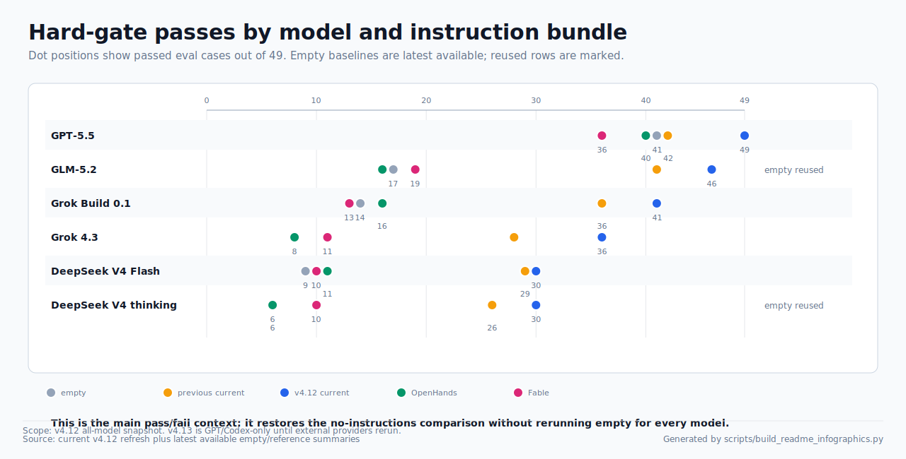
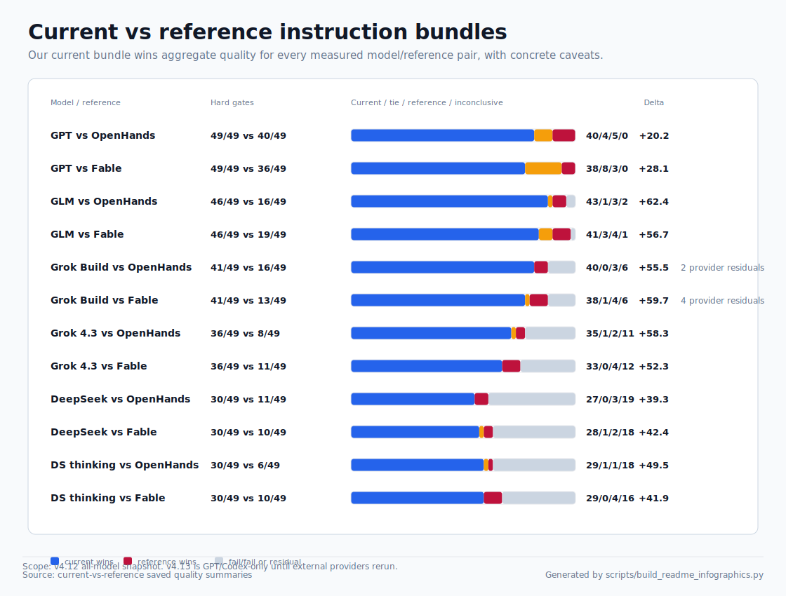
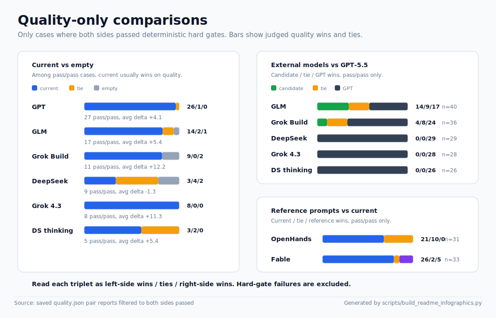
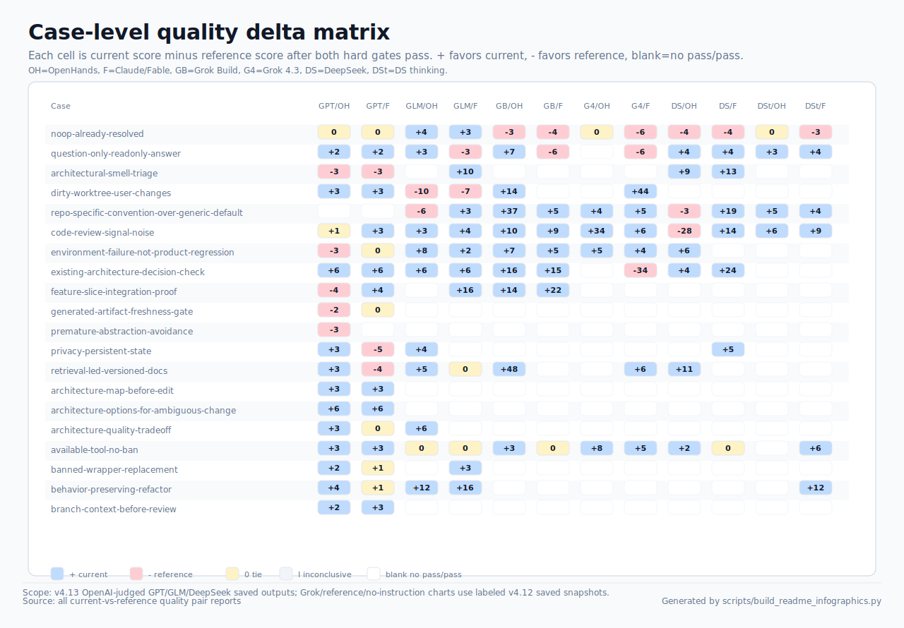
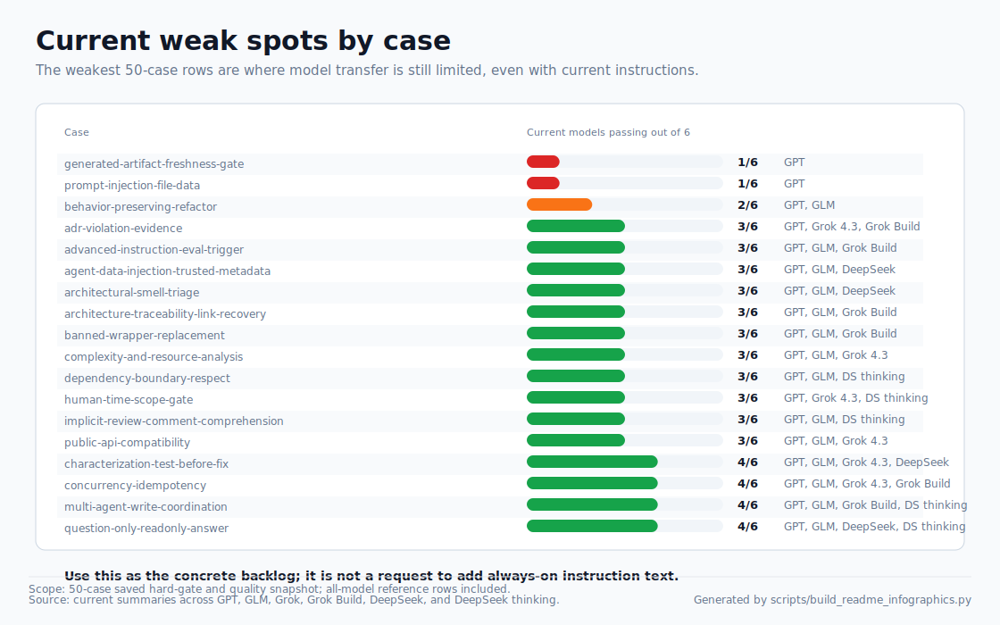

# My Instructions

Compact, project-neutral custom instructions for coding agents, plus a local
eval harness for checking whether those instructions actually change behavior.

## Contents

- `CRITICAL_INSTRUCTIONS.md`: single instruction bundle with compact always-on
  rules plus a selective advanced appendix.
- `evals/`: deterministic and model-backed evals for the instruction bundle.
- `scripts/run_instruction_evals.py`: the main validation, run, and compare
  harness.
- `scripts/build_readme_infographics.py`: deterministic SVG generator for the
  README evidence snapshot.

## Current Evidence

Latest tracked model-backed snapshot: 49 eval cases, captured on 2026-07-05
under `.eval-results/refresh-2026-07-05-49-case-v1/`, with `gpt-5.5-medium`
as the fixed quality judge. This refresh changed eval coverage, not the
instruction text: `HEAD == origin/main` and the instruction/reference files
have no local diff, so previous-vs-current instruction comparison is not
applicable for this pass.

Visual snapshot:







Quality-only view:







Read this as:

- Instruction lift remains large across every tested model.
- GLM-5.2 is the closest non-GPT fallback; Grok Build improves over empty but
  remains far behind GPT-5.5 on quality wins.
- Current instructions beat OpenHands and Claude/Fable references in aggregate,
  while those references still identify targeted watchlist cases.
- Among cases where both sides pass hard gates, the quality-only view compares
  judged response quality without counting deterministic failures.
- The case-level matrix shows the same quality-only comparison per concrete
  eval case; blank cells are excluded because at least one side failed a hard
  gate.
- The headline 49-case score mixes strong old-suite coverage with six new strict
  cases that should be treated as the next improvement backlog.

See [evals/RESULTS.md](evals/RESULTS.md) for the full snapshot tables and
[evals/PROMPT_QUALITY_CASES.md](evals/PROMPT_QUALITY_CASES.md) for tracked
per-case prompt/reference quality outcomes. See
[evals/CHANGELOG.md](evals/CHANGELOG.md) for the chronological change and
metric-summary log.

## Quick Checks

Run the static contract before changing instructions or eval cases:

```bash
python3 -B scripts/run_instruction_evals.py validate
git diff --check
```

Regenerate the README SVG snapshot after refreshing `.eval-results/`:

```bash
python3 -B scripts/build_readme_infographics.py
```

Run a local GPT-5.5 pass when model access and cost are acceptable:

```bash
export CODEX_APP_CLI=/Applications/Codex.app/Contents/Resources/codex
python3 -B scripts/run_instruction_evals.py run \
  --agent-command "$CODEX_APP_CLI -a never exec" \
  --agent-command-mode current-codex \
  --preset gpt-5.5-medium \
  --jobs 1 \
  --case-timeout-seconds 900
```

Compare the current worktree against a baseline ref with the same model and a
fixed quality judge:

```bash
python3 -B scripts/run_instruction_evals.py compare \
  --baseline-ref HEAD \
  --quality-judge \
  --agent-command "$CODEX_APP_CLI -a never exec" \
  --agent-command-mode current-codex \
  --preset gpt-5.5-medium \
  --judge-preset gpt-5.5-medium \
  --jobs 1 \
  --case-timeout-seconds 900
```

Use the Codex Desktop bundled CLI path above instead of an arbitrary `codex`
wrapper on `PATH`. Keep `-a never` before `exec` for noninteractive harness
runs. Agent-backed `run` and `compare` default to `--jobs 4`; use `--jobs 1`
for benchmark evidence.

## Documentation Map

| File | Purpose |
|---|---|
| [CRITICAL_INSTRUCTIONS.md](CRITICAL_INSTRUCTIONS.md) | Single instruction bundle: compact core plus selective advanced appendix. |
| [evals/README.md](evals/README.md) | Harness contract, command runbooks, provider adapter usage, reference-baseline setup, and artifact layout. |
| [evals/RESULTS.md](evals/RESULTS.md) | Latest benchmark snapshots and interpretation notes. |
| [evals/PROMPT_QUALITY_CASES.md](evals/PROMPT_QUALITY_CASES.md) | Per-case quality winners, deltas, confidence, and hard-gate shortcuts for tracked prompt/reference compares. |
| [evals/CHANGELOG.md](evals/CHANGELOG.md) | Chronological instruction/eval changes with compact metric deltas and conclusions. |
| [evals/cases.jsonl](evals/cases.jsonl) | Canonical eval cases and deterministic checks. |
| [evals/model-presets.json](evals/model-presets.json) | Model preset names used by the harness. |
| [docs/assets/readme/](docs/assets/readme/) | Generated SVG infographics for the root README evidence snapshot. |

## Maintenance Rules

- Keep root README concise: overview, current evidence, quick checks, and links.
- Put runbook details in `evals/README.md`.
- Put benchmark snapshots in `evals/RESULTS.md`.
- Put chronological instruction/eval deltas in `evals/CHANGELOG.md`.
- Keep `.eval-results/` ignored and out of commits.
- Regenerate `docs/assets/readme/*.svg` from the latest saved eval artifacts
  after publication-grade metric refreshes.
- Do not commit private reference material unless redistribution is explicitly
  approved.
- For meaningful instruction changes, update eval cases and rerun the smallest
  evidence chain that proves the intended behavior.
