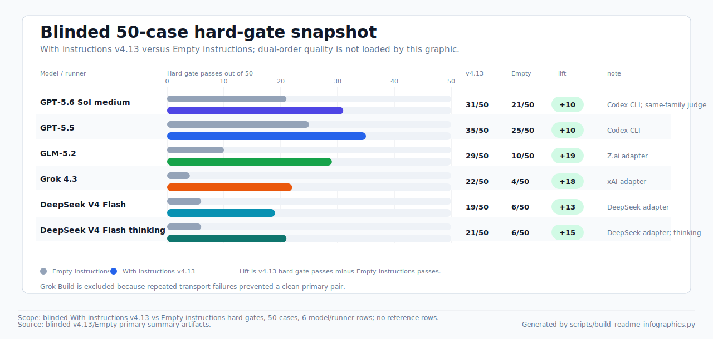

# My Instructions

Compact, project-neutral custom instructions for coding agents, plus a local
eval harness for checking whether those instructions actually change behavior.

## Contents

- `CRITICAL_INSTRUCTIONS.md`: single instruction bundle with compact always-on
  rules plus a selective advanced appendix.
- `evals/`: deterministic and model-backed evals for the instruction bundle.
- `scripts/run_instruction_evals.py`: the main validation, run, and compare
  harness.
- `scripts/build_readme_infographics.py`: deterministic SVG and social-card
  PNG generator for the public evidence snapshot.

## Blinded Six-Model Evidence

The 2026-07-10 publication uses clean blinded current and empty runs for six
model/runner rows. Primary hard-gate results:

| Model | Current | Empty | Lift |
|---|---:|---:|---:|
| GPT-5.5 | 35 / 50 | 25 / 50 | +10 |
| GPT-5.6 Sol medium | 31 / 50 | 21 / 50 | +10 |
| GLM-5.2 | 29 / 50 | 10 / 50 | +19 |
| Grok 4.3 | 22 / 50 | 4 / 50 | +18 |
| DeepSeek V4 Flash | 19 / 50 | 6 / 50 | +13 |
| DeepSeek V4 Flash thinking | 21 / 50 | 6 / 50 | +15 |

Dual-order quality consensus reports `current / empty / tie / order-sensitive / inconclusive`:

| Model | Current | Empty | Tie | Order-sensitive | Inconclusive |
|---|---:|---:|---:|---:|---:|
| GPT-5.5 | 21 | 2 | 5 | 8 | 14 |
| GPT-5.6 Sol medium | 21 | 3 | 3 | 6 | 17 |
| GLM-5.2 | 27 | 1 | 0 | 2 | 20 |
| Grok 4.3 | 21 | 0 | 1 | 0 | 28 |
| DeepSeek V4 Flash | 16 | 2 | 0 | 1 | 31 |
| DeepSeek V4 Flash thinking | 18 | 0 | 1 | 2 | 29 |

Fixed dual-order quality judge: `gpt-5.6-sol-medium`.

The GPT-5.6 Sol row uses the same model family as the fixed quality judge; this is instruction-lift evidence, not a cross-model leaderboard.

These are within-runner current-vs-empty instruction comparisons, not a cross-model leaderboard.

No OpenHands, Claude/Fable, or other reference rows are included.

Grok Build is excluded because repeated transport failures prevented a clean primary pair.

Canonical dual-order publication artifacts live under
`.eval-results/blinded-50-case-v1/dual-order-quality-v2/`.

Current blinded visual snapshot:




## Historical Evidence

Legacy pre-blinding snapshot: primary prompts exposed case id/scenario metadata
(prompt contamination). The unchanged numbers are historical and are not clean
blinded instruction-lift evidence.

Current eval contract: `evals/cases.jsonl` contains 50 cases. The 2026-07-08
addition covers Agent Data Injection where forged trusted/action metadata
appears inside an untrusted data field. That 50-case saved quality
snapshot covers hard gates, current-vs-empty saved-output quality for all six
tested runners, GPT-vs-external current quality, and all-model reference
comparisons. GPT/Codex passed 50/50 current and 37/50 empty; GLM-5.2 reached
46/50 current; Grok 4.3 reached 33/50 current; Grok Build 0.1 reached 31/50
current; DeepSeek V4 Flash non-thinking reached 31/50 current; DeepSeek V4
Flash thinking reached 34/50 current.

current-vs-empty saved quality is positive for all six tested runners. External
transfer is mixed, not uniformly positive: GLM-5.2 is closest to GPT on the
current-output quality comparison, while the other external rows remain far
behind GPT. all-model reference rows are now included for OpenHands and
Claude/Fable; Grok Build reference rows include observed adapter/provider
agent failures from the saved runs rather than smoothed reruns. Source
artifacts live under
`.eval-results/refresh-2026-07-08-50-case-public-v1/`,
`.eval-results/refresh-2026-07-08-50-case-v1/`,
`.eval-results/refresh-2026-07-08-50-case-v2/`, and
`.eval-results/refresh-2026-07-08-50-case-quality-v1/`.

Archived context: v4.13 had a clean GPT/Codex 49-case compare against `HEAD` in
`.eval-results/v4.13-final-gpt55-full-49-v11/`: 98/98 hard gates passed.
Rejudged with the same OpenAI/Codex saved-output judge in
`.eval-results/openai-canonical-judge-2026-07-07-v1/`, current won 30 quality
comparisons, baseline won 6, there were 13 ties, and average delta was +1.53.
This remains useful historical context, but the headline snapshot above is the
legacy pre-blinding 50-case publication artifact.

The saved 49-case context is split by scope:

- v4.13 current-vs-previous quality, same judge:
  GPT-5.5 stays 49/49 hard gates and improves on quality
  (30 current wins, 13 ties, 6 previous wins, average delta +1.53).
  GLM-5.2 stays 46/49 and is close but mixed
  (28 current wins, 5 ties, 15 previous wins, 1 inconclusive, average +0.6).
  DeepSeek V4 Flash improves hard gates from 25/49 to 35/49 and average
  quality by +20.1, mostly by fixing hard failures. DeepSeek V4 thinking
  regresses from 33/49 to 28/49 and average quality -10.2.
- On current instructions, GPT-5.5 remains the strongest runner. GLM-5.2 is
  the closest external row: 46/49 hard gates and a narrow quality gap versus
  GPT (21 GLM wins, 5 ties, 23 GPT wins, average delta -7.1). DeepSeek V4
  Flash narrows its previous gap to GPT (-53.6 to -35.3) but remains far
  behind; DeepSeek V4 thinking widens its gap (-39.2 to -48.1).
- Saved Grok context is still v4.12 empty-vs-current, not fresh v4.13
  current-vs-previous evidence. With the same OpenAI/Codex judge, saved Grok
  4.3 current beats empty by +59.8 average quality and saved Grok Build 0.1
  merged current beats empty by +58.5. Treat these as baseline context only.
- Saved OpenHands and Claude/Fable reference comparisons are still useful
  contrast. They do not overturn the aggregate current-instruction result, but
  recurring reference wins remain in `noop-already-resolved`,
  `behavior-preserving-refactor`, `architectural-smell-triage`,
  `dependency-boundary-respect`, and several DeepSeek-specific ownership or
  review cases.

Read this as:

- The 50-case refresh is a legacy pre-blinding snapshot, not clean blinded
  instruction-lift evidence, a model leaderboard, or proof that every runner
  improved in quality.
- GLM-5.2 is the closest external quality row versus GPT. Other external rows
  still trail GPT materially despite positive current-vs-empty instruction lift.
- Reference bundles are useful as contrast, not as winners. The promoted
  reference snapshot now covers all six saved current runners against both
  reference bundles.

See [evals/RESULTS.md](evals/RESULTS.md) for the full snapshot tables and
[evals/PROMPT_QUALITY_CASES.md](evals/PROMPT_QUALITY_CASES.md) for tracked
per-case prompt/reference quality outcomes. See
[evals/CHANGELOG.md](evals/CHANGELOG.md) for the chronological change and
metric-summary log.

## Quick Checks

Run the static contract before changing instructions or eval cases:

```bash
python3 -B scripts/run_instruction_evals.py validate
git diff --check
```

Check that tracked README SVGs and the social-card PNG are fresh:

```bash
python3 -B scripts/build_readme_infographics.py --check
```

When `.eval-results/` artifacts are available, check that published 50-case
numbers still match the saved JSON, docs point to the saved artifact roots,
README links every required SVG, the five publication documents keep both the
new blinded scope and the adjacent legacy pre-blinding caveats, and generated
assets carry the matching six-model scope:

```bash
python3 -B scripts/check_published_eval_metrics.py
```

Regenerate the README SVG and social-card snapshot after refreshing
`.eval-results/`:

```bash
python3 -B scripts/build_readme_infographics.py
```

Run a local GPT-5.5 pass when model access and cost are acceptable:

```bash
export CODEX_APP_CLI=/Applications/Codex.app/Contents/Resources/codex
python3 -B scripts/run_instruction_evals.py run \
  --agent-command "$CODEX_APP_CLI -a never exec" \
  --agent-command-mode current-codex \
  --preset gpt-5.5-medium \
  --jobs 1 \
  --case-timeout-seconds 900
```

Compare the current worktree against a baseline ref with the GPT-5.5 primary
agent and the fixed Sol medium quality judge:

```bash
python3 -B scripts/run_instruction_evals.py compare \
  --baseline-ref HEAD \
  --quality-judge \
  --agent-command "$CODEX_APP_CLI -a never exec" \
  --agent-command-mode current-codex \
  --preset gpt-5.5-medium \
  --judge-preset gpt-5.6-sol-medium \
  --jobs 1 \
  --case-timeout-seconds 900
```

For publication-grade saved-output quality, run both baseline/candidate orders
and treat a disagreeing semantic verdict as `order_sensitive`; see
`evals/README.md` for the fixed-judge policy.

Use the Codex Desktop bundled CLI path above instead of an arbitrary `codex`
wrapper on `PATH`. Keep `-a never` before `exec` for noninteractive harness
runs. Agent-backed `run` and `compare` default to `--jobs 4`; use `--jobs 1`
for benchmark evidence.

## Documentation Map

| File | Purpose |
|---|---|
| [CRITICAL_INSTRUCTIONS.md](CRITICAL_INSTRUCTIONS.md) | Single instruction bundle: compact core plus selective advanced appendix. |
| [evals/README.md](evals/README.md) | Harness contract, command runbooks, provider adapter usage, reference-baseline setup, and artifact layout. |
| [evals/RESULTS.md](evals/RESULTS.md) | Latest benchmark snapshots and interpretation notes. |
| [evals/PROMPT_QUALITY_CASES.md](evals/PROMPT_QUALITY_CASES.md) | Per-case quality winners, deltas, confidence, and hard-gate shortcuts for tracked prompt/reference compares. |
| [evals/CHANGELOG.md](evals/CHANGELOG.md) | Chronological instruction/eval changes with compact metric deltas and conclusions. |
| [evals/cases.jsonl](evals/cases.jsonl) | Canonical eval cases and deterministic checks. |
| [evals/model-presets.json](evals/model-presets.json) | Model preset names used by the harness. |
| [docs/assets/readme/](docs/assets/readme/) | Generated SVG infographics for the root README evidence snapshot. |
| [docs/assets/social/](docs/assets/social/) | Generated social-card PNGs for public metric snapshots. |

## Maintenance Rules

- Keep root README concise: overview, current evidence, quick checks, and links.
- Put runbook details in `evals/README.md`.
- Put benchmark snapshots in `evals/RESULTS.md`.
- Put chronological instruction/eval deltas in `evals/CHANGELOG.md`.
- Keep `.eval-results/` ignored and out of commits.
- Regenerate `docs/assets/readme/*.svg` and `docs/assets/social/*.png` from
  the latest saved eval artifacts after publication-grade metric refreshes.
- Do not commit private reference material unless redistribution is explicitly
  approved.
- For meaningful instruction changes, update eval cases and rerun the smallest
  evidence chain that proves the intended behavior.
